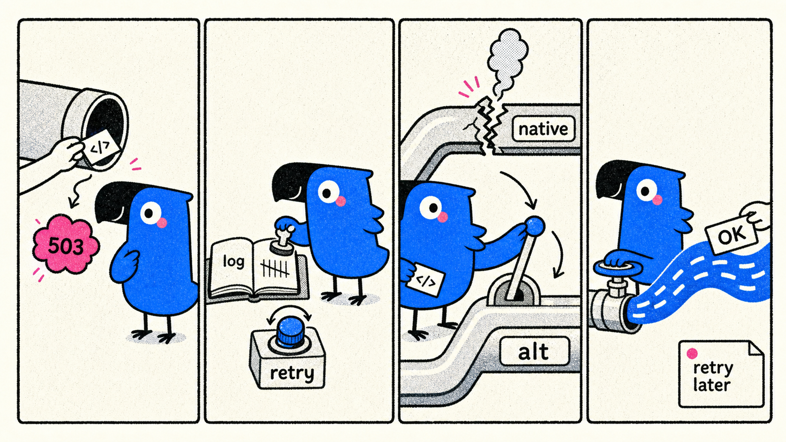

# MAAS Lifeboat



中文 | [English](README.en.md)

一个本地 OpenAI/Anthropic 兼容网关，用来把一个经常返回 `503` / `10310 system busy` 的 MAAS coding provider 变得更可用。

它做四件事：**记录每次后端请求、单账号全局排队、温和串行重试、在 OpenAI/Anthropic 两个兼容接口之间 fallback**。如果上游最终还是忙，它会返回更标准的可重试错误，让 PI agents、Cursor、OpenWebUI、LangChain 等客户端有机会自动重试。

它不做一件事：**不承诺把上游 50%-60% 的真实容量变成 100%**。如果问题来自账号、模型池或 provider 容量，网关只能降低失败体感，不能凭空创造容量。

## 这个仓库是干嘛的？

| 项目 | 内容 |
| --- | --- |
| 输入协议 | OpenAI-compatible `/v1/chat/completions`；Anthropic-compatible `/anthropic/v1/messages` |
| 后端协议 | MAAS OpenAI-compatible endpoint；MAAS Anthropic-compatible endpoint |
| 核心策略 | 单账号 in-flight queue、低并发串行重试、跨接口 fallback、stream 首 chunk 保护、标准化可重试错误 |
| 观测能力 | JSONL ledger 记录每次 attempt；console 打印每次重试接口、状态码、错误码、耗时 |
| 不影响系统 | 只支持 request-level proxy，不修改系统代理 |
| 主要使用场景 | PI agents / Cursor / OpenWebUI / LangChain 这类 OpenAI-compatible 客户端 |

## 当前实验结论

| 问题 | 当前结论 | 证据强度 |
| --- | --- | --- |
| 主要失败是什么？ | 几乎都是 HTTP `503` + provider code `10310` + `The system is busy, please try again later.` | 强 |
| 是本地 gateway bug 吗？ | 不像。两个后端接口都会返回同一个 busy 信号。 | 中-强 |
| 是 OpenAI 接口坏、Anthropic 接口好吗？ | 不是。两个接口都能成功，也都能 busy；paired probe 里 9/20 个窗口只有一边失败。 | 中 |
| 为什么还要做接口转换？ | 转换能救“当前客户端入口失败、另一个入口成功”的窗口；paired probe 里这类窗口占 9/20。 | 中-强 |
| 两个接口能当独立 provider 吗？ | 不能当两个供应商看。20 个 paired 窗口里 9 个两边一起失败，说明共享明显的上游 busy burst。 | 中-强 |
| 改 route/IP/proxy 一定有用吗？ | 目前没有足够证据。只能当实验变量，不是主解法。 | 弱-中 |
| 有可观测限流/容量阈值吗？ | 这个 provider 把 busy/限流/容量不足都暴露成 `503/10310`；目前没测出稳定固定窗口。 | 中 |
| 为什么 PI 并行时会卡？ | 长 streaming 请求会占用窗口；HTTP `200` 不等于客户端马上看到有效 chunk。 | 中 |
| 7 次串行是否万能？ | 不是。真实日志里出现过 7/7 全 busy；5 次默认更温和，7 次只适合高价值请求。 | 强 |

## 关键数据

| 数据来源 | 样本 | 首次 attempt 成功 | 网关最终成功 | 后端 attempts | 关键现象 |
| --- | ---: | ---: | ---: | ---: | --- |
| PI-agent console excerpt，2026-07-04 | 15 个有 `request end` 的 streaming 请求 | 7/16 | 14/15 | 36 | 1 个请求 7/7 全部 `503/10310`，随后客户端重试成功 |
| 本地 gateway JSONL ledger | 15 个 streaming 请求 | 6/15 | 15/15 | 39 | 9/15 需要至少一次后端重试；延迟 1.604s-16.937s |
| 早期 OpenAI 单接口探测 | 53 次请求 | 未单独统计 | 33/53 = 62.3% | 53 | 单接口成功率明显不稳定 |
| 早期 Anthropic 单接口探测 | 50 次请求 | 未单独统计 | 29/50 = 58.0% | 50 | 与 OpenAI 接口同量级 |
| 早期 HTTP proxy route 探测 | 104 次请求 | 未单独统计 | 63/104 = 60.6% | 104 | 没看到“换路由就稳定”的证据 |
| 2026-07-04 温和 probe | 140 个非流式独立请求 | 75/140 = 53.6% | 离线 5 次预算约 88.2%，7 次预算约 95.5% | 140 | `503/10310` 呈 burst；同一窗口 OpenAI/Anthropic 强相关 |

这些样本还不够大，不能当通用 benchmark。它们能支持的判断是：**失败机制不像单纯客户端错误，也不像某一个协议面完全坏掉；更像上游容量在短时间内波动。**

详细证据见 [docs/reliability-findings.md](docs/reliability-findings.md)。

## 为什么还要做 OpenAI/Anthropic 转换？

| 价值 | 说明 |
| --- | --- |
| 弱去相关 fallback | paired probe 里有 7 个 `OpenAI ok / Anthropic fail` 和 2 个 `OpenAI fail / Anthropic ok` 窗口。只要客户端当前走的是失败那一边，转换到另一边就可能救回来。 |
| 协议兼容 | 上层客户端通常只会说一种协议。转换层让 OpenAI 客户端能尝试 Anthropic 入口，也让 Anthropic 客户端能尝试 OpenAI 入口。 |
| 保留工具调用/streaming | 如果 fallback 只能非流式、不能转换 tool calls，PI/Cursor 这类 coding agent 仍然很难用。 |
| 观测统一 | 两个入口的 attempt 都进入同一套 ledger，才能判断失败相关性和真实 attempt 成本。 |

这不是“两个供应商高可用”。如果两个入口同一窗口都 `503/10310`，转换救不了；这时只能返回标准可重试错误，让客户端做下一轮请求级 retry。

## 推荐运行策略

| 策略项 | 推荐值 | 原因 |
| --- | --- | --- |
| 并发 | 默认 `MAAS_MAX_INFLIGHT_REQUESTS=1` | PI 并行对话会在本地排队，避免同时占住同一个上游容量窗口 |
| 默认后端 attempts | `5` | 比 7 次更温和；仍能覆盖多数短暂 busy 窗口 |
| 高价值 attempts | `7` | PI 实测中能救回一些请求，但仍可能 7/7 全 busy |
| 尝试顺序 | `native -> native -> alternate -> native -> alternate` | 先给原生接口一次同接口重试，再采样另一个兼容入口 |
| 重试方式 | 串行 + backoff + jitter | 避免 aggressive hedging 把上游打得更忙 |
| 最终失败 | 返回 OpenAI `503` 或 Anthropic `529` | 让 PI 这类客户端能继续做请求级重试 |
| proxy | 只做 request-level proxy | 不修改系统代理，不影响其他应用 |

## 证据边界

| 还没证明的事 | 当前处理 |
| --- | --- |
| 账号级限制、模型池限制、provider 全局拥塞三者怎么区分 | 只能说更像上游容量问题；不能精确归因 |
| route/IP/proxy 是否能稳定提高成功率 | 单账号下很难和自然恢复窗口分开；先不作为主力方向 |
| 精确 RPM / TPM / 并发阈值 | provider 使用 `503/10310` 表达压力；不把经验阈值写成稳定 rate limit |
| delayed hedging 是否值得 | 暂不默认开启；如果实现，必须加预算和延迟触发 |
| 大 token / 长上下文请求表现 | 当前实验主要是低成本短请求和真实 PI streaming 日志 |

## 下一步：继续逼近最优策略

当前实验说明“转换 + 重试”有价值，但还没给出最优算法。下一轮目标不是继续证明 provider 很烂，而是比较不同策略在同一约束下的收益：

| 新增 replay 观察 | 结论 |
| --- | --- |
| 同窗口 fallback | OpenAI -> Anthropic 和 Anthropic -> OpenAI 都是 11/20；转换有用，但只救单边失败窗口 |
| 并行 hedge 上界 | 同样 11/20，但每个请求固定消耗 2 次后端 attempts；不适合作为默认 |
| busy 后立刻重试 | `<0.5s` 内下一次 0/25 成功；说明立即重打很差 |
| busy 后短冷却 | `0.5-2s` 下一次 13/18 成功；支持 backoff/cooldown 方向 |
| x7 串行 | 比 x5 多救一部分窗口，但 p95 wall time 明显变长；只适合高价值请求 |

| 策略方向 | 想解决的问题 | 下一步实验 |
| --- | --- | --- |
| 自适应接口排序 | 最近 OpenAI/Anthropic 哪个更健康，是否应该动态先试它 | 用 paired/probe ledger 做 EWMA replay |
| 全局并发队列 | PI 并行对话会互相挤占上游窗口 | 已加入 `MAAS_MAX_INFLIGHT_REQUESTS`；下一步 dogfood 对比 |
| burst 冷却/熔断 | 两个接口连续 busy 时继续打可能只是浪费 attempts | 已加入 all-busy 后短 cooldown；下一步 dogfood |
| client-level retry 协同 | 7/7 全失败后下一轮可能立刻成功 | all-busy 时返回更长 `Retry-After`，观察 PI 是否尊重 |
| delayed hedging | 首包慢和 busy 快失败是两种问题 | 只在首包慢时小预算 hedging，不对 busy 快失败 hedging |

注意：paired probe 里的 9/20 both-fail 不是“单账号最终成功率天花板”。它只说明同一瞬间做协议转换救不了；冷却、串行重试和客户端 retry 等待的是下一个时间窗口，仍然可能把最终成功率往上推。

研究计划和当前实验状态记录在 [docs/strategy-optimization-plan.md](docs/strategy-optimization-plan.md)。离线策略 replay 见 [docs/results/maas-strategy-replay-2026-07-04.md](docs/results/maas-strategy-replay-2026-07-04.md)。

## 功能

- OpenAI-compatible `POST /v1/chat/completions`
- Anthropic-compatible `POST /anthropic/v1/messages`
- Local `/v1/models`
- 串行重试 + 跨接口 fallback + 温和 backoff/jitter
- 单账号 in-flight queue，默认同时只放行 1 个客户端 generation
- all-busy 后短 cooldown，避免队列里的下一位立刻撞上同一段 busy burst
- OpenAI 客户端路径下 fallback 仍保持 streaming
- stream 首 chunk timeout：上游 HTTP `200` 但迟迟没有有效首包时，可以换下一次 attempt
- OpenAI `tool_calls` 与 Anthropic `tool_use` 双向转换
- 最终失败返回更标准的可重试错误
- JSONL 请求账本 + console attempt 日志
- request-level proxy，不修改系统代理

## 安装

```bash
python3 -m pip install -e ".[test]"
cp .env.example .env.local
chmod 600 .env.local
$EDITOR .env.local
```

关键环境变量：

```bash
MAAS_API_KEY='<upstream provider key>'
MAAS_GATEWAY_API_KEY='local-client-key'
MAAS_PROXY_URL=''
MAAS_MAX_INFLIGHT_REQUESTS=1
MAAS_MAX_BACKEND_ATTEMPTS=5
MAAS_ENABLE_CROSS_INTERFACE_FALLBACK=1
MAAS_SAME_RETRY_DELAY_S=0.8
MAAS_ALT_RETRY_DELAY_S=1.2
MAAS_RETRY_BACKOFF_MULTIPLIER=1.5
MAAS_MAX_RETRY_DELAY_S=3.0
MAAS_RETRY_JITTER_S=0.25
MAAS_BUSY_COOLDOWN_S=1.0
MAAS_ALL_BUSY_RETRY_AFTER_S=3
MAAS_STREAM_FIRST_CHUNK_TIMEOUT_S=20
```

`MAAS_API_KEY` 是上游 provider key。`MAAS_GATEWAY_API_KEY` 是本地客户端访问这个 gateway 的 key。不要把这两个值设成一样。

如果需要 SOCKS proxy 支持：

```bash
python3 -m pip install -e ".[socks]"
```

## 启动

```bash
scripts/start_gateway.sh
```

OpenAI-compatible 客户端配置：

```text
OPENAI_BASE_URL=http://127.0.0.1:18788/v1
OPENAI_API_KEY=<MAAS_GATEWAY_API_KEY>
```

PI agents provider 示例：

```json
{
  "baseUrl": "http://127.0.0.1:18788/v1",
  "api": "openai-completions",
  "apiKey": "!cat /path/to/local-client-key",
  "models": [
    {
      "id": "astron-code-latest",
      "name": "Astron Code Latest",
      "contextWindow": 500000,
      "maxTokens": 131072
    }
  ]
}
```

默认模型元数据按当前观测的 GLM 5.2 / Astron Code 设置：500k context window，131072 max output tokens。若 provider 调整限制，可用 `MAAS_CONTEXT_WINDOW` 和 `MAAS_MAX_TOKENS` 覆盖。

## macOS 用户服务

只创建当前用户的 LaunchAgent，监听 `127.0.0.1`，不修改系统代理。

```bash
scripts/install_launchagent.sh
```

卸载：

```bash
scripts/uninstall_launchagent.sh
```

## 诊断

```bash
scripts/doctor_gateway.sh
tail -f logs/gateway_requests.jsonl
```

服务 console 会打印每次 attempt：

```text
[maas-gateway] request start id=... surface=openai stream=true ...
[maas-gateway] queue acquired id=... surface=openai limit=1 waited=0.0s
[maas-gateway] attempt id=... n=1/5 interface=openai ok=false status=503 code=10310 ...
[maas-gateway] attempt id=... n=3/5 interface=anthropic ok=true status=200 ...
[maas-gateway] queue release id=... surface=openai limit=1
[maas-gateway] request end id=... ok=true attempts=3 ...
```

如果一个请求所有后端 attempts 都是 `503/10310`，会额外看到：

```text
[maas-gateway] cooldown set id=... surface=openai sleep=1.0s reason=all_attempts_10310
```

ledger 只记录 payload hash 和 attempt metadata，不记录完整 prompt 或 API key。

Provider probe：

```bash
python3 experiments/probe_maas.py --interfaces both --pattern paired --repeat 20 --rate-interval 0.35 --concurrency 1 --route-label direct
python3 experiments/analyze_maas_ledger.py logs/probe_maas.jsonl logs/gateway_requests.jsonl --output docs/results/maas-probe-2026-07-04.md
```

`logs/` 下的原始 JSONL ledger 默认不提交。对外分享前只使用聚合结果，并确认没有 key、完整 prompt、proxy URL 或个人路径。

## 项目结构

```text
gateway/app.py          FastAPI routes
gateway/strategy.py     retry/fallback strategy and backend calls
gateway/protocols.py    OpenAI/Anthropic payload and response conversion
gateway/sse.py          SSE parsing and streaming conversion
gateway/errors.py       retry classification and client error envelopes
gateway/config.py       environment-backed settings
gateway/logging.py      console logs and JSONL ledger helpers
```

`gateway/maas_gateway.py` 只是 `uvicorn gateway.maas_gateway:app` 的轻入口。

## 测试

```bash
python3 -m pytest -q
python3 -m compileall -q gateway
```

## 当前限制

- 上游 stream 已经给客户端发出 chunk 后，不能无损切换到另一个 completion。
- streaming 转换覆盖 text 和 tool-call delta；复杂 multimodal streaming 未覆盖。
- 成功率最终受上游容量限制。gateway 能改善瞬时失败处理，但不能修复账号级或 provider-wide 饱和。
- route/proxy 可以作为 request-level 实验变量，但当前证据不能证明换 IP 会稳定修复 `503/10310`。
